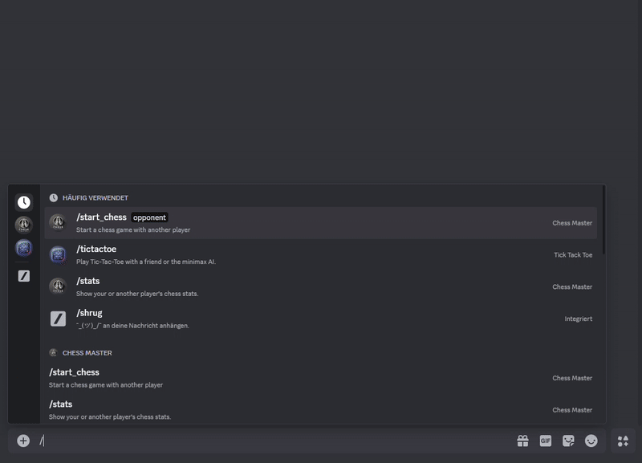

# ChessMasterBot: Features & Setup
# Project of Paul Absmanner (k12205739) and Maximilian Hammer (k12222785)

This bot allows you to play chess directly in Discord, complete with:
- **Real-time board rendering** (image updates after each move)
- **Offer Draw (Remi)** or **Surrender** during your turn
- **Game statistics** tracking (wins, losses, draws, games played)
- **Persistent** stats stored in a JSON file


## Key Features

1. **Start a Game**  
   Use `/start_chess @opponent` to begin a new game. 
   - The bot checks if both players are free (not already in another game).
   - Assigns White and Black roles, renders the initial board, and prompts the White player to move first.

2. **Board Updates & Piece Selection**  
   - On each turn, the bot shows a selection of piece types (Pawn, Rook, Knight, etc.).
   - Once you pick a piece type, the bot lists all possible moves for that type.
   - Clicking a move button updates the board image and hands the turn to your opponent.
   - While one player is selecting his move, other players are not able to execute buttons.

3. **Draw (Remi) & Surrender**  
   - **Draw (Remi)**: Current player can offer a draw, prompting the opponent with “Accept Draw” or “Deny Draw.”  
     - **Accept**: Game ends as a draw.  
     - **Deny**: Game continues normally.  
   - **Surrender**: Current player can concede the game, immediately declaring the opponent the winner.

4. **Game End & Final Board**  
   - On **checkmate** or **stalemate** (automatic detection), the bot renders and displays the final board image, then declares the winner or a draw.
   - **Surrender** also triggers a final board render showing the exact position at surrender.
   - Once a game ends, the main chessboard message is updated to remove all buttons, preventing further moves.

5. **Stats Tracking**  
   - Upon a completed game (win, loss, draw), player stats are updated:
     - `games_played`, `wins`, `losses`, `draws`.
   - Stats are **saved** to a `stats.json` file, ensuring **persistence** between bot restarts.

6. **Viewing Stats**  
   - Use `/stats @player` (or just `/stats`) to see cumulative stats:
     - Games Played
     - Wins
     - Losses
     - Draws


# Getting Started


## Create a Discord Bot

### Step 1: Enable Developer Mode

1. Go to **User Settings** in Discord.
2. Navigate to **Advanced** and enable **Developer Mode**.

[Guide for enabling Developer Mode](https://www.partitionwizard.com/partitionmagic/discord-developer-mode.html)

---

### Step 2: Create a Bot in the Discord Developer Portal

1. Visit the [Discord Developer Portal](https://discord.com/developers/applications).
2. Create a new application.
3. On the left sidebar, select Bot, scroll down to **Privileged Gateway Intents**.
4. Enable **Server Members Intent** (Required for processing message content directly)
5. Scroll up and press **Reset Token** and save it for later.
6. On the left sidebar, select OAuth2. From the **OAuth2 URL Generator** under **scopes List** select **bot** and **applications.commands**
7. Select the permissions under **OAuth2 URL Generator** under **bot permission List**

To operate correctly, the BOT requires the following permissions to be enabled on the server where it is hosted:

- Send Messages
- Attach Files
- View Channels

8. Copy the generated URL and add the bot to your discord server.


### Step 3: Copy the Server(GUILD_ID) ID from your discord server

1. Right-click the server icon.
2. Click **Copy Server ID**.


# Local Setup Instructions

1. Open the `.env.example` file in the project directory and rename it to `.env`.
2. Replace the placeholders with your bot token and discord server ID:
   ```bash
   TOKEN=YOUR_BOT_TOKEN
   GUILD_ID=YOUR_GUILD_ID
   ```


2. **Install Dependencies**  

Make sure you have the following installed:

   ```bash
   pip install -r requirements.txt
   ```

3. **Run the Bot**  
   - `python ChessMasterBot.py` 
   - Once running, the bot will sync slash commands to your server and load stats from `stats.json`

4. **Play Chess!**  
   - In a Discord channel, type `/start_chess @username` to challenge someone.
   - The bot posts the board and starts the game.

5. **View Stats**
   - Use `/stats @player` (or just `/stats`) to see cumulative stats.